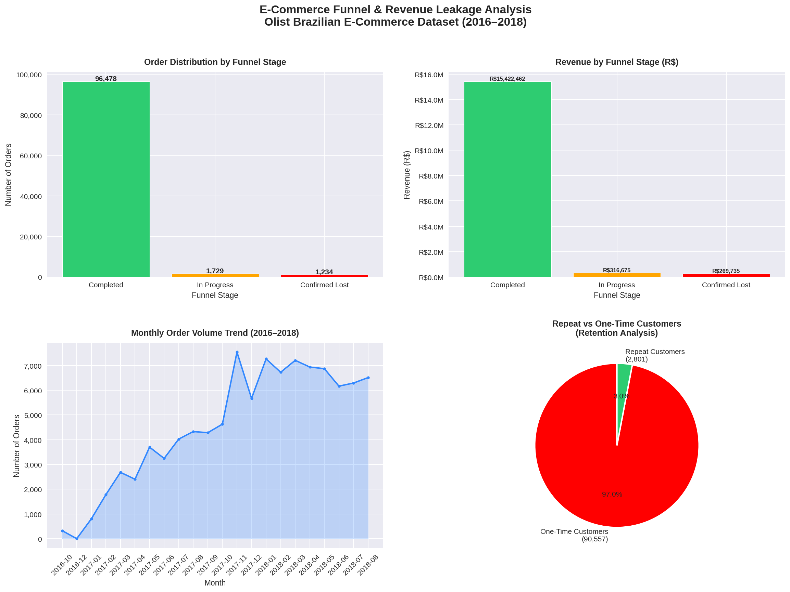

# E-Commerce Funnel & Revenue Leakage Analysis


---

## 📌 Business Problem

An e-commerce platform wants to understand where customers are dropping off in the purchase funnel and how much revenue is being lost at each stage. The business needs answers to three questions:

- Where exactly are customers abandoning their orders?
- How much confirmed revenue has been lost?
- Who are the most valuable customers and are we retaining them?

---

## 🎯 Objective

Map the complete customer journey across 5 funnel stages, quantify confirmed revenue leakage, segment customers by value and geography, and deliver actionable business recommendations backed by real data.

---

## 📊 Dataset

**Source:** [Olist Brazilian E-Commerce Dataset — Kaggle](https://www.kaggle.com/datasets/olistbr/brazilian-ecommerce)

| File | Records | Description |
|------|---------|-------------|
| olist_orders_dataset.csv | 99,441 | Order lifecycle and status |
| olist_order_payments_dataset.csv | 103,886 | Payment methods and values |
| olist_order_items_dataset.csv | 112,650 | Items bought, price, freight |
| olist_customers_dataset.csv | 99,441 | Customer location data |

**Why Olist?**
Real transactional data from a Brazilian e-commerce marketplace covering 2016–2018. Multi-table relational structure mirrors real company databases — requires proper aggregation and joining before analysis.

---

## 🛠️ Tools & Technologies

| Tool | Purpose |
|------|---------|
| Python | Core analysis language |
| Pandas | Data manipulation, merging, grouping |
| NumPy | Numerical calculations |
| Matplotlib | Base visualisation engine |
| Seaborn | Statistical charts |
| Google Colab | Cloud notebook environment |
| GitHub | Version control and portfolio |

---

## 📁 Repository Structure

```
ecommerce-funnel-analysis/
│
├── Ecommerce_Funnel_Analysis.ipynb   # Main analysis notebook
├── ecommerce_analysis.png             # Project visualisations
├── olist_master_clean.csv             # Cleaned master dataset
└── README.md                          # Project documentation
```

---

## 🔍 Analysis Workflow

```
Step 1 → Load 4 datasets and understand structure
Step 2 → Data quality check — missing values analysis
Step 3 → Define funnel stages from order status
Step 4 → Aggregate payments and items (prevent row duplication)
Step 5 → Build master table via left joins
Step 6 → Handle nulls — ghost orders and incomplete records
Step 7 → Revenue leakage calculation
Step 8 → Geographic segmentation across 27 states
Step 9 → Customer value segmentation (Low/Medium/High)
Step 10 → Visualisations and business recommendations
```

---

## 📈 Key Findings

### Funnel Analysis
| Stage | Orders | Revenue | % of Total |
|-------|--------|---------|------------|
| Completed | 96,478 | R$ 15,422,462 | 96.34% |
| In Progress | 1,729 | R$ 316,675 | 1.98% |
| Confirmed Lost | 1,234 | R$ 269,735 | 1.68% |

### Revenue Leakage
- **R$ 269,735** in confirmed lost revenue across 1,234 orders
- **R$ 316,675** in at-risk revenue from 1,729 in-progress orders
- Lost orders had **avg value of R$218 vs R$160** for completed — high-value transactions failing disproportionately

### Customer Segmentation
| Segment | Customers | Revenue | Avg Spend |
|---------|-----------|---------|-----------|
| High (R$500+) | 4,265 (4.6%) | R$ 3,937,638 (25.5%) | R$ 923 |
| Medium (R$100-500) | 45,843 (49.1%) | R$ 8,874,164 (57.5%) | R$ 194 |
| Low (R$0-100) | 43,249 (46.3%) | R$ 2,610,659 (16.9%) | R$ 60 |

### Retention Analysis
- **Repeat purchase rate: 3.23%** — 90,557 of 93,358 customers ordered only once
- Critical retention gap — acquiring new customers costs 5–7x more than retaining existing ones

### Business Growth
- Grew from ~300 orders/month (Oct 2016) to peak of ~7,500 (Nov 2017)
- **25x growth in 13 months**
- November 2017 spike attributed to Brazilian Black Friday
- Stabilised at ~6,500 orders/month through 2018

---

## 💡 Business Recommendations

### 1. IMMEDIATE — Fix Cancellation Root Causes
- Audit checkout UX and payment gateway reliability
- Target: reduce cancellation rate by 50%
- **Estimated recovery: R$134,000+**

### 2. SHORT TERM — VIP Retention Programme
- Personally engage 4,265 high-value customers
- Loyalty rewards, priority support, early access offers
- **Estimated impact: protect R$3.9M revenue base**

### 3. MEDIUM TERM — Improve Repeat Purchase Rate
- Email re-engagement campaigns for 90,557 one-time buyers
- Target: move repeat rate from 3.23% to 6%
- **Impact: ~2,800 additional orders annually**

### 4. LONG TERM — Inventory Management Overhaul
- 609 unavailable orders = seller-side fulfilment failure
- Implement seller performance scoring system
- Penalise sellers with high unavailability rates

---

## 📊 Visualisations



---

## 🚀 How To Run This Project

1. Clone this repository
```bash
git clone https://github.com/kaleabhishek/ecommerce-funnel-analysis
```

2. Download the Olist dataset from [Kaggle](https://www.kaggle.com/datasets/olistbr/brazilian-ecommerce)

3. Upload the following CSV files to your Colab environment:
   - olist_orders_dataset.csv
   - olist_order_payments_dataset.csv
   - olist_order_items_dataset.csv
   - olist_customers_dataset.csv

4. Open `Ecommerce_Funnel_Analysis.ipynb` in Google Colab and run all cells

---

## 👤 Author

**Abhishek Gajanan Kale**
- 📧 abhishekkale914@gmail.com
- 💼 [LinkedIn](https://linkedin.com/in/Abhishekkale314)
- 🐙 [GitHub](https://github.com/kaleabhishek)

---

## 📝 Notes

- All monetary values are in Brazilian Reais (R$)
- Dataset covers September 2016 to October 2018
- First and last months trimmed from trend analysis due to incomplete data collection at dataset boundaries
- Ghost orders (created but abandoned before item assignment) treated as zero revenue — not deleted

---

*This project was built as part of a data analytics portfolio to demonstrate end-to-end analytical thinking on real business data.*
